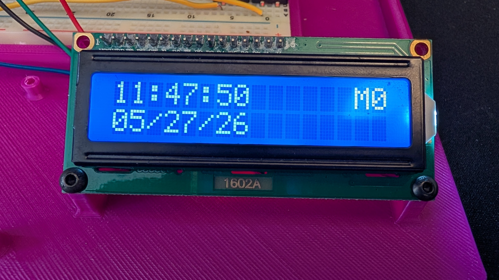
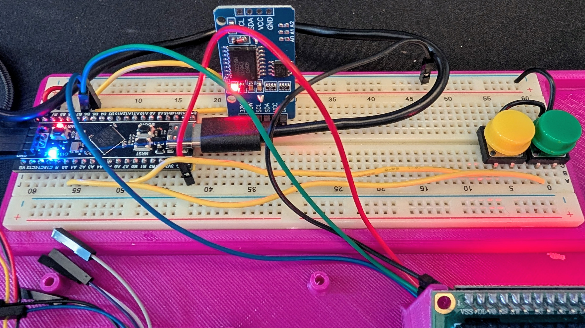

# stm32-blackpill-rtc



A real-time clock display built on the STM32F411CEU6 (BlackPill) using a DS3231 RTC module and a 1602A LCD with I2C backpack.

Reads time and date from the DS3231 over I2C and displays it on the LCD. Two buttons let you cycle through and edit each field directly on the device — no USB required after flashing.

## Features

- Live time and date display (HH:MM:SS / MM/DD/YY)
- 7-state edit mode: cycle through hours, minutes, seconds, month, date, and year
- Seconds reset to zero in seconds edit mode (Casio-style)
- Live seconds tick while editing other fields
- Internal pull-ups — no external resistors needed for buttons

## Hardware

- [WeAct STM32F411CEU6 BlackPill](https://github.com/WeActStudio/WeActStudio.MiniSTM32F4x1)
- DS3231 RTC module (I2C, address `0x68`)
- 1602A LCD with PCF8574T I2C backpack (address `0x27`)
- 2× tactile buttons (MODE, UP)

## Wiring



| Signal     | BlackPill Pin |
|------------|---------------|
| I2C SDA    | PB7           |
| I2C SCL    | PB6           |
| BUTTON_MODE | PA0          |
| BUTTON_UP  | PA7           |

Both DS3231 and LCD share the same I2C bus. Buttons connect to GND — internal pull-ups are enabled in firmware.

## Building

This project uses [STM32CubeIDE](https://www.st.com/en/development-tools/stm32cubeide.html) / STM32CubeMX with the HAL framework.

Import the project and build with the generated Makefile, or open directly in STM32CubeIDE.

## Flashing

```bash
# Using ST-Link via OpenOCD
openocd -f interface/stlink.cfg -f target/stm32f4x.cfg \
  -c "program build/BlackPill.elf verify reset exit"
```

Or drag-and-drop the `.bin` onto the BlackPill's DFU bootloader (hold BOOT0 on reset).

## License

MIT
